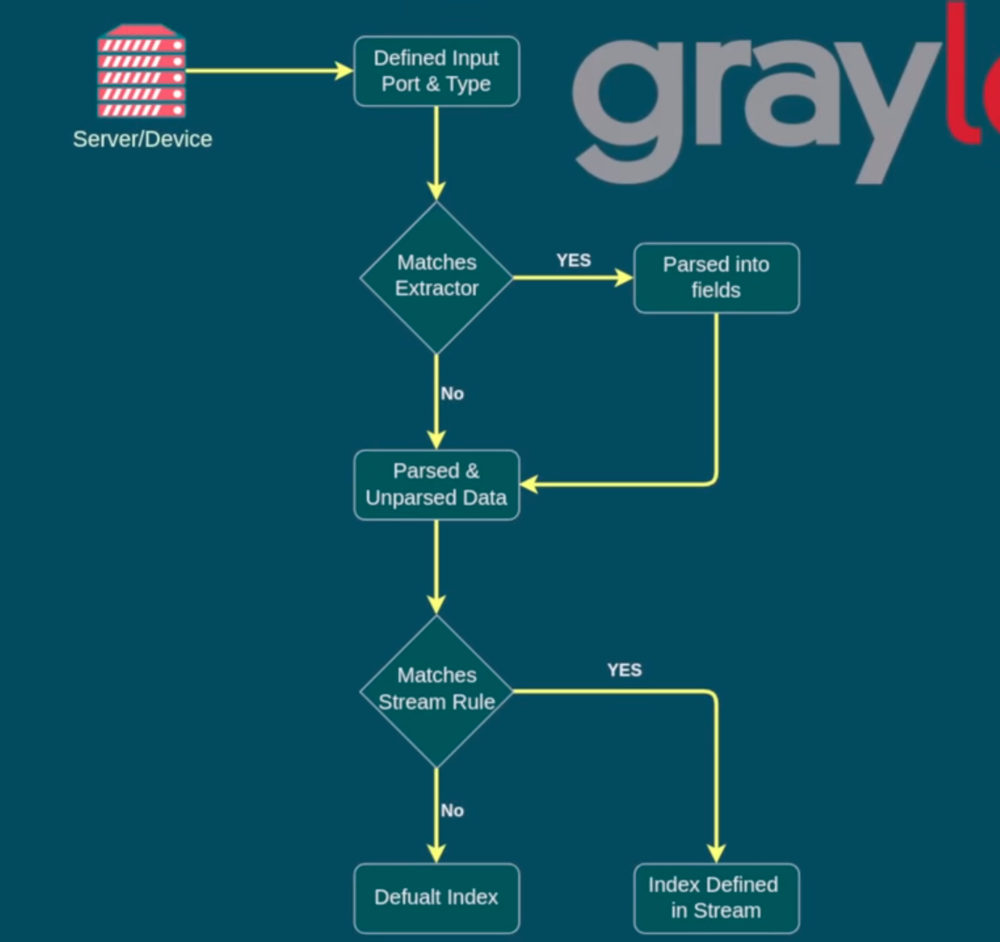

# Log Analysis Project Helping Resources List

## Sample Softwares to get an Idea!

1. [**Open Source Log Analysis Tools**](https://opensource.com/article/19/4/log-analysis-tools)
    - Contain details of these tools:
        1. [**Graylog**](https://www.graylog.org/products/open-source)
        2. [**Nagios**](https://www.nagios.org/downloads/)
        3. [**Elastic Stack(the "ELK Stack")**](https://www.elastic.co/products)
        4. [**LOGalyz**](http://www.logalyze.com/)
        5. [**Fluentd**](https://www.fluentd.org/)

2. Some More Tools to Checkout:
    1. [**Sumologic**](https://www.sumologic.com/)
    2. [**DATADOG**](https://www.datadoghq.com/)
    3. [**Logstash**](https://www.elastic.co/logstash)
    4. [**Logtail**](https://betterstack.com/logs?gad=1)
    5. [**GoAccess**](https://goaccess.io/)
    6. [**AWStats**](https://awstats.sourceforge.io/)

## Testing Softwares Installation Procedure:

1. **Graylog Installation**

- Followed According to it's documentation Instruction;
    👉[**Instructions for Installation**](https://go2docs.graylog.org/5-1/downloading_and_installing_graylog/ubuntu_installation.html)👈
    1. Installing Mongodb and Opensearch for Dependency,
    2. Then Config the Opensearch YAML file.

#### Graylog Functionality:

- Defining Ports and Inputs, to get the particular data from running service on the machine.

- Data is then **Stored** in **two forms** : **unstructured** and **structured**.

- The **Structured Data** is much convenient cause it helps to categorize and analyze the data, but we've also an option to **search through unstructured data** just in needed case.

- Then It'll prepare the Index according to the Final Log Data we get.

#### Inspiration from Graylog:

- The ecosystem is clean and simple.

- ID Reference to the logs, especially better for creating a custom category to view some specific data.

- Support Custom configuration and settings to manage data with prepared queries.

- Notifications facility (able to inform to clients and owners by sending a copy of report)

- Pulling Up data from multiple sources (services) and able to create custom data extractor for specific need.

2. **Nagios Core 

## Project Discussion:

### Project Design:

#### Logs Fetching Manner:

- All important logs will be fetched in a raw manner first (unstructured data) and their is also a option in the UI Logs Viewer Panel to checkout the **raw logs**
