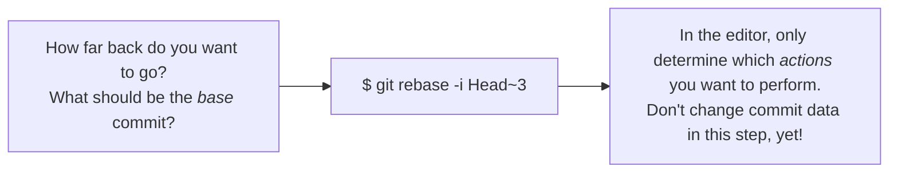

## Advanced Git:

### 1. Interactive Rebase

- A tool for optimizing and cleaning up your commit history
  - change a commit's message
  - delete commits
  - reorder commits
  - combine multiple commits into one
  - edit/split an existing commit into mutiple new ones

> Interactive rebase will rewrite your commit history so the rewriting
> commits are new commits with new hash Ids.

> It's kind of rule that you should not use the interactive rebase on
> commits that you've already pushed/shared on a remote repository!

> Use the interactive rebase only for cleaning up your local commit
> history before merging in into a shared team branch.

- A good example is to use when you're done developing on a feature
  branch before you merge it back to the team branch, you can optimize
  that, clean-up the commit structure and so it's easier to understand.

- That's exactly the interactive rebase is mean't to do.

- Interactive rebase step-by-step:



- **Example for changing the commit message through interactive rebase**:
  - First we'll check how far we have to go back to make changes in
    the commit, the command below will provide us all of the commit hashes!
  ```
  git log --oneline
  ```
  - we can count them manually that how back we wanted to go, or can
    directly use the hash, then using the rebase command, for example
    here we are going 3 commits back:
  ```
  git rebase -i HEAD~3
  ```
  - Then a editor window will pop-up, where you can only specify what
    kind of changes/action that you wanted to perform, the description
    of actions will be there!
  - like for example we are taking `reword` for commit and then again
    again after saving and exiting the file a window will appear where
    we can make a change to the commit message that's exactly what
    `reword` keyword meant for.
