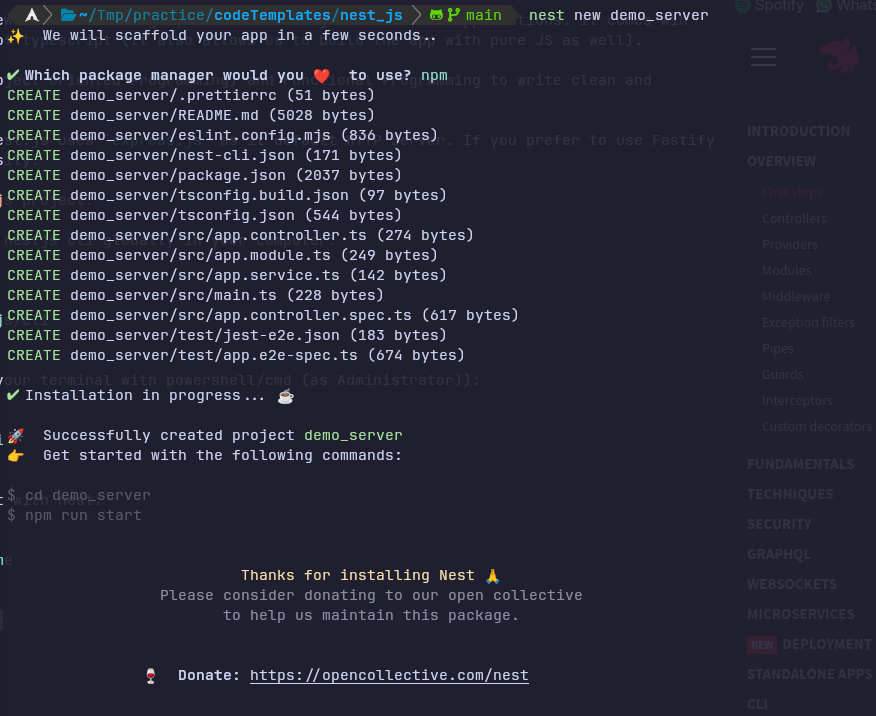

# Nest JS Notes

## What is nest.js?

- nest.js is a framework to build highly scalable node.js server-side applications. It comes wih
  the full support of typescript (It also allows us to build the app with pure JS as well).

- It combines OOP(Object Oriented Programming) and Functional Programming to write clean and
  reusable code.

- Under the hood, nest.js uses `express.js` as it default HTTP Server. If you prefer to use Fastify,
  you can switch easily.

## Generating nest.js project:

- First install the nestjs cli globally in your computer:

- for Linux

```
sudo npm i -g @nestjs/cli
```

- for Windows (run your terminal with powershell/cmd (as Administrator)):

```
npm i -g @nestjs/cli
```

- creating a project with nest:

```
nest new project-name
```

- select the package manager you want to continue with and it's done:



## Understanding the nest.js project structure:

- `node_modules`: Contains all the libraries that are required for your project.

- `src`: Contains your application source code, Under this directory nest.js has generated a starter
  code: - `app.controller.spec.ts`: Contains unit test cases for each controller implementation - `app.controller.ts`: Contains the implementation of the API. - `app.service.ts`: Contains business logic which will be used in the controller. - `app.module.ts`: Contains imports, exports and DI (Dependency Injection). - `main.ts`: Contains implementation to bootstrap the application. This is the starting point
  of your application. - `test`: Contains E2E test case implementations. - `.eslintrc.js` Contains lint configuration that helps to identify incorrect syntax, typescript
  standards and more... - `.gitignore`: Contains files and directories to ignore when pushing the code to GitHub - `.prettierc`: Contains prettier config to format your code. - `nest-cli.json`: Basic nest.js configuration. - `package.json`: Contains documentation of your project. - `README.md`: Contains documentation of your project. - `tsconfig.json`: Contains typescript configuration.

## Creating our first API

- open the `app.controller.ts` file:
  - add `/user` route to `@Controller()` decorator
  - change the function name under `@Get()` decorator to `getUsers`
  - change return type from `string` to `string[]`.
  - change the App service method name to `getUsers`.

Code Snippet (`app.controller.ts` file):

```
import { Test, TestingModule } from '@nestjs/testing';
import { AppController } from './app.controller';
import { AppService } from './app.service';

describe('AppController', () => {
  let appController: AppController;

  beforeEach(async () => {
    const app: TestingModule = await Test.createTestingModule({
      controllers: [AppController],
      providers: [AppService],
    }).compile();

    appController = app.get<AppController>(AppController);
  });

  describe('root', () => {
    it('should return "Hello World!"', () => {
      expect(appController.getHello()).toBe('Hello World!');
    });
  });
});
```

- now open `app.service.ts`
  - change the function name `getHello()` inside AppService Class to `getUsers()`
  - change return type from `string` to `string[]`.
  - change the return value from `'Hello World!'` to `['userOne', 'userTwo']`

Code Snippet (`app.service.ts` file):

```
import { Injectable } from '@nestjs/common';

@Injectable()
export class AppService {
  getUsers(): string[] {
    return ['userOne', 'userTwo'];
  }
}
```

- Done!
