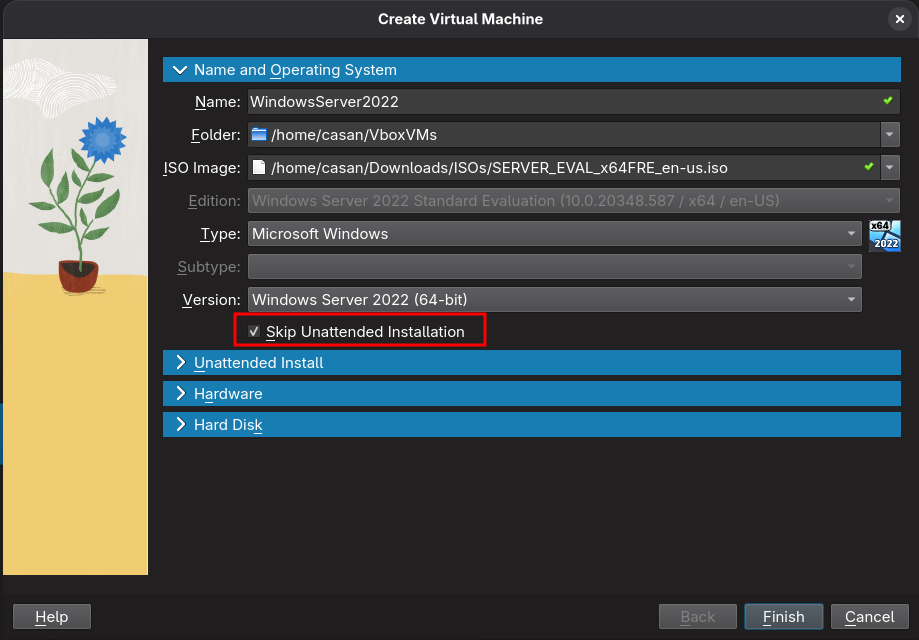

## Virtualbox Lab Setup

### For Windows Server:

#### Objective:

- We need to setup a lab environment for Windows Server Practical, which
  is going to include these basic VMs:

1. (One) Windows Server 2022 or Any Later version VM (For Server)
   - With at least `2 processor`, from the system tab of virtualbox VM settings
   - At leat `4Gb` of RAM
   - **Most Important**: skip unattended installation option to be checked while configuring
     the VM for the first time.

2. (Two) Windows Enterprise or Windows Professional OS VM (For Client)
   - With at least `2 processor`, from the system tab of virtualbox VM settings
   - At leat `4Gb` of RAM

> Set Network Settings with Bridged Adapter if you want the internet to be on/working
> on your virtual machines, (In the Static IP allocation, you need first check the
> Network Range from the main pc/system, ipconfig or ifconfig in case of linux and
> then allocate the IP of the same network range to the VMs otherwise the internet
> will not be there!), otherwise in case of obtaining IP automatically will give the
> working IP that'll work with Internet too.

> In case of DHCP practical, you might need to switch your network settings to the
> internal network on individual VMs, (because logically there should be only one
> DHCP server in a single network), Internet will not work there, but the practical
> for DHCP can be performed well with this.
